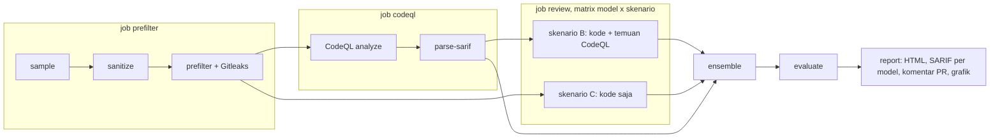

# TRISULA

[](https://github.com/MIlhamRidhoP/TRISULA-PROJECT/actions/workflows/ci.yml)

TRISULA menjalankan CodeQL di GitHub Actions, meminta tiga LLM (Gemini, GPT, Grok) meninjau setiap file dengan dan
tanpa temuan CodeQL, lalu menggabungkan putusannya. Hasilnya diukur terhadap ground truth OWASP Benchmark untuk
SQL injection (CWE-89) dan cross-site scripting (CWE-79), sehingga pengaruh lapisan LLM bisa dihitung.

Framework ini hanya membaca kode dan melapor. Kode target tidak pernah diubah.

## Cara kerja



| Skenario | Masukan ke LLM | Run | Tujuan |
|---|---|---|---|
| `A` | tidak ada | 1 | Baseline CodeQL |
| `B-<model>` | kode dan temuan CodeQL untuk file itu | 3 | LLM memberi putusan akhir |
| `C-<model>` | kode saja | 1 | Mengukur seberapa besar bantuan petunjuk CodeQL |
| `ENS` | tidak ada panggilan baru | turunan | Voting mayoritas dari `B-*` run 1 |

Jika panggilan LLM tetap gagal setelah retry, skenario B memakai putusan CodeQL dan skenario C menghitung kasus itu
sebagai tidak rentan. Setiap panggilan di-cache berdasarkan hash dari model, versi prompt, prompt yang sudah
dirender, nomor run, dan parameter pemanggilan, lalu dicatat sebagai satu baris JSON berisi token, latensi, biaya,
dan respons mentah.

Aturan lengkap untuk metrik, pencocokan temuan, dan penanganan error ada di [docs/DESIGN.md](docs/DESIGN.md).
Sampling dan sanitasi dataset ada di [docs/DATASET.md](docs/DATASET.md).

## Instalasi

Membutuhkan Python 3.12.

```bash
git clone https://github.com/MIlhamRidhoP/TRISULA-PROJECT.git
cd TRISULA-PROJECT
python -m venv .venv
source .venv/bin/activate        # Windows: .venv\Scripts\activate
pip install -r requirements.txt
```

## Menjalankan demo

```bash
python -m trisula demo
```

Demo tidak butuh akses jaringan maupun API key. Demo memakai proyek kecil buatan sendiri di `demo/benchmark_mini`
(meniru bentuk OWASP Benchmark, 12 kasus tersampel), file SARIF CodeQL buatan tangan, dan tiga salinan model mock
yang deterministik. Semua tahap selesai dalam beberapa detik, hasilnya ditulis ke `.cache/demo/results/`:

```
INFO trisula.evaluate: evaluated 8 scenarios on 12 cases, best pooled score A=0.500 -> .cache/demo/results/summary.json
INFO trisula.report.build: wrote 9 report files (15 findings for developers) -> .cache/demo/results
INFO trisula.demo: demo finished -> .cache/demo/results/report.html
```

Salinan laporan hasil demo ada di [docs/example-report.html](docs/example-report.html). Putusan mock berasal dari
hash nama file, jadi angkanya tidak menggambarkan kinerja model sungguhan.

## Menjalankan dengan model sungguhan

1. Isi API key sebagai environment variable. Jangan pernah di-commit; nama variabelnya ada di `.env.example`.

   ```bash
   export GEMINI_API_KEY=...
   export OPENAI_API_KEY=...
   export XAI_API_KEY=...
   ```

2. Siapkan target dan hasil CodeQL. Tahap sampling meng-clone BenchmarkJava pada commit yang dikunci di
   `benchmark.ref` ke `.cache/benchmark/`, lalu menulis proyek hasil pangkas ke `targets/` (tidak di-commit).
   Folder `data/` yang di-commit hanya berisi metadata dari tahap ini: nama test case, label, dan pemetaan ke nama
   netral. Tidak ada kode benchmark di dalamnya.

   ```bash
   python -m trisula sample
   python -m trisula sanitize
   python -m trisula prefilter
   python -m trisula parse-sarif --sarif path/to/java.sarif --timing path/to/timing.json
   ```

   CodeQL sendiri berjalan di job `codeql` pada `.github/workflows/trisula.yml`. Di lokal, gunakan file SARIF hasil
   CodeQL CLI.

3. Mulai dengan uji coba kecil dan periksa log panggilan sebelum run penuh:

   ```bash
   python -m trisula review --model gpt --scenario B --run 1 --limit 3
   ```

   Buka `results/raw/calls-B-gpt-run1.jsonl` dan periksa model ID, tingkat reasoning yang benar-benar dikirim,
   jumlah token, biaya, dan apakah JSON lolos validasi tanpa retry.

4. Run penuh, lalu agregasi:

   ```bash
   python -m trisula review --model gemini --scenario B     # semua run yang dikonfigurasi
   python -m trisula review --model gemini --scenario C
   # ulangi untuk gpt dan grok
   python -m trisula ensemble
   python -m trisula evaluate
   python -m trisula report
   ```

### Di GitHub Actions

Tambahkan `GEMINI_API_KEY`, `OPENAI_API_KEY`, dan `XAI_API_KEY` di Settings > Secrets and variables > Actions.
Workflow `trisula` berjalan saat push ke `main`, saat pull request dari repositori yang sama, dan secara manual
lewat `workflow_dispatch` dengan input opsional `limit`, `models`, dan `scenarios`. Pull request dari fork hanya
menjalankan job prefilter dan CodeQL, jadi secret tidak pernah terpapar ke kode dari fork. Setiap job review hanya
menerima kunci milik modelnya sendiri. Dengan `models=mock`, seluruh pipeline bisa dijalankan tanpa secret.

## Konfigurasi

Semua nilai penelitian ada di [config/trisula.yml](config/trisula.yml): model dan harga, jumlah run, ukuran dan
seed sampel, CWE dalam cakupan, tingkat reasoning, batas retry, ambang ensemble, dan pengaturan laporan. Kode
membaca nilai dari sana; tidak ada yang ditulis langsung di kode. Kunci yang penting:

| Kunci | Arti |
|---|---|
| `project.source_paths` | Yang dianalisis CodeQL |
| `project.llm_paths` | Yang boleh dikirim ke LLM, setelah lolos prefilter |
| `benchmark.ref` | Commit BenchmarkJava untuk eksperimen (dikunci) |
| `llm.models.<kunci>` | Provider, model ID, variabel kunci, tingkat reasoning, harga |
| `llm.scenarios` | Jumlah run per skenario dan apakah petunjuk CodeQL disertakan |
| `ensemble.min_votes` | Jumlah suara agar ensemble menyatakan kasus rentan |
| `prefilter.pii_mode` | `warn` atau `exclude` untuk file berisi email, nomor telepon, atau deret 16 digit |

Template prompt ada di [prompts/sast_review.md](prompts/sast_review.md). Versinya harus sama dengan
`llm.prompt_version`, dan versi itu menjadi bagian dari kunci cache.

Untuk menganalisis proyek lain, arahkan `project.*` ke proyek tersebut dan hapus bagian `benchmark`; `sample` dan
`sanitize` hanya untuk OWASP Benchmark.

## Keluaran

| Path | Isi |
|---|---|
| `results/prefilter.json` | File yang boleh dikirim ke LLM, dan file yang dikeluarkan beserta alasan dan barisnya, tanpa nilai |
| `results/codeql/alerts.json` | Alert CodeQL dalam cakupan beserta langkah aliran data |
| `results/verdicts/<skenario>-<model>-run<N>.jsonl` | Hasil per file untuk setiap run review |
| `results/raw/calls-*.jsonl` | Satu baris per percobaan panggilan API |
| `results/findings.jsonl` | Temuan ternormalisasi untuk semua skenario |
| `results/summary.csv`, `summary.json`, `per_case.csv` | Metrik, konsistensi, biaya, uji McNemar |
| `results/report.html` | Tabel evaluasi, grafik, dan tampilan developer yang bisa difilter |
| `results/sarif/trisula-<model>.sarif` | SARIF 2.1.0 per model untuk GitHub Code Scanning |
| `results/pr_comment.md` | Ringkasan untuk komentar pull request |
| `results/figures/*.pdf` | Grafik paper, lebar satu kolom IEEE, tetap terbaca dalam hitam putih |

## Struktur proyek

```
config/trisula.yml        konfigurasi penelitian
prompts/sast_review.md    template prompt (instrumen penelitian)
docs/                     catatan desain, dataset, dan provider
demo/                     proyek demo offline dan SARIF CodeQL
data/                     metadata sampel dan pemetaan nama (tanpa kode benchmark)
trisula/                  framework
  sampling.py sanitize.py   persiapan OWASP Benchmark
  prefilter.py              seleksi file sebelum panggilan LLM
  codeql.py                 parser SARIF
  llm/                      render prompt, jalur pemanggilan, adaptor (Gemini, kompatibel OpenAI, mock)
  review.py                 orkestrasi review
  normalize.py ensemble.py  temuan dan voting
  evaluate.py stats.py      metrik dan uji McNemar
  report/                   SARIF, komentar PR, HTML, grafik
tests/                    tes pytest
.github/workflows/        trisula.yml (pipeline), ci.yml (lint dan tes)
```

## Pengembangan

```bash
pytest -q
ruff check . && ruff format --check .
```

## Keterbatasan

- LLM hanya melihat satu file dalam satu waktu. Sebagian kasus OWASP Benchmark aman atau rentan karena kelas helper
  yang tidak ikut dikirim.
- OWASP Benchmark bersifat publik dan mungkin ada di data pelatihan model. Sanitasi menghapus nama, komentar, dan
  path servlet, tapi tidak bisa menghilangkan hafalan sepenuhnya.
- Header `X-XSS-Protection` hanya muncul di kasus xss dan sengaja dibiarkan karena merupakan header HTTP standar,
  sehingga tetap menjadi petunjuk kategori bagi model.
- Test case benchmark pendek dan sintetis. Hasil pada aplikasi nyata bisa berbeda.
- Tingkat reasoning dengan nama yang sama tidak setara antar-provider.
- Biaya dihitung dari harga daftar di konfigurasi, bukan dari tagihan.
- Versi model bisa berubah di sisi provider. Karena itu model ID dan respons mentah selalu dicatat.

## Lisensi

Kode framework dirilis dengan [Lisensi MIT](LICENSE).

OWASP Benchmark berlisensi GPL-2.0 dan tidak didistribusikan di repositori ini; `python -m trisula sample`
mengunduhnya dari repositori resmi saat dijalankan. Proyek di `demo/benchmark_mini` adalah sekumpulan kecil file
buatan sendiri yang hanya meniru struktur Benchmark.
