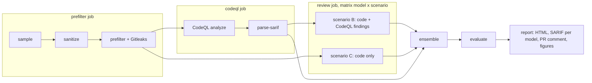

# TRISULA

[](https://github.com/MIlhamRidhoP/TRISULA-PROJECT/actions/workflows/ci.yml)

TRISULA runs CodeQL in GitHub Actions, asks three LLMs (Gemini, GPT, Grok) to review each file with and without the
CodeQL findings, and combines their verdicts. It also measures the result against OWASP Benchmark ground truth for
SQL injection (CWE-89) and cross-site scripting (CWE-79), so the effect of the LLM layer can be quantified.

The framework only reads code and reports. It never modifies the target.

## How it works



| Scenario | LLM input | Runs | Purpose |
|---|---|---|---|
| `A` | none | 1 | CodeQL baseline |
| `B-<model>` | code and CodeQL findings for the file | 3 | LLM gives the final verdict |
| `C-<model>` | code only | 1 | Measures how much the CodeQL hints help |
| `ENS` | no new calls | derived | Majority vote of `B-*` run 1 |

When an LLM call fails after retries, scenario B falls back to the CodeQL verdict and scenario C counts the case as
not vulnerable. Every call is cached by a hash of the model, prompt version, rendered prompt, run number, and call
parameters, and logged as one JSON line with tokens, latency, cost, and the raw response.

The full rules for metrics, matching, and error handling are in [docs/DESIGN.md](docs/DESIGN.md). Dataset sampling
and sanitization are in [docs/DATASET.md](docs/DATASET.md).

## Installation

Requires Python 3.12.

```bash
git clone https://github.com/MIlhamRidhoP/TRISULA-PROJECT.git
cd TRISULA-PROJECT
python -m venv .venv
source .venv/bin/activate        # Windows: .venv\Scripts\activate
pip install -r requirements.txt
```

## Run the demo

```bash
python -m trisula demo
```

The demo needs no network access and no API key. It uses a small hand-written project in `demo/benchmark_mini`
(shaped like OWASP Benchmark, 12 sampled cases), a hand-written CodeQL SARIF file, and three copies of a
deterministic mock model. It runs every stage in a few seconds and writes to `.cache/demo/results/`:

```
INFO trisula.evaluate: evaluated 8 scenarios on 12 cases, best pooled score A=0.500 -> .cache/demo/results/summary.json
INFO trisula.report.build: wrote 9 report files (15 findings for developers) -> .cache/demo/results
INFO trisula.demo: demo finished -> .cache/demo/results/report.html
```

A copy of the resulting report is in [docs/example-report.html](docs/example-report.html). The mock verdicts are
derived from file name hashes, so the numbers say nothing about real models.

## Run with real models

1. Set the API keys as environment variables. Never commit them; `.env.example` lists the names.

   ```bash
   export GEMINI_API_KEY=...
   export OPENAI_API_KEY=...
   export XAI_API_KEY=...
   ```

2. Prepare the target and CodeQL results. Sampling clones BenchmarkJava at the locked commit in `benchmark.ref`
   into `.cache/benchmark/` and writes the trimmed project to `targets/` (not committed). The committed `data/`
   folder only holds metadata from that step: case names, labels, and the mapping to neutral names. It contains no
   benchmark code.

   ```bash
   python -m trisula sample
   python -m trisula sanitize
   python -m trisula prefilter
   python -m trisula parse-sarif --sarif path/to/java.sarif --timing path/to/timing.json
   ```

   CodeQL itself runs in the `codeql` job of `.github/workflows/trisula.yml`. Locally you can pass a SARIF file
   produced by the CodeQL CLI.

3. Start with a small trial and check the call log before a full run:

   ```bash
   python -m trisula review --model gpt --scenario B --run 1 --limit 3
   ```

   Look at `results/raw/calls-B-gpt-run1.jsonl`: model ID, the reasoning setting that was sent, token counts, cost,
   and whether the JSON passed validation without retries.

4. Full run, then aggregate:

   ```bash
   python -m trisula review --model gemini --scenario B     # all configured runs
   python -m trisula review --model gemini --scenario C
   # repeat for gpt and grok
   python -m trisula ensemble
   python -m trisula evaluate
   python -m trisula report
   ```

### In GitHub Actions

Add `GEMINI_API_KEY`, `OPENAI_API_KEY`, and `XAI_API_KEY` under Settings > Secrets and variables > Actions. The
`trisula` workflow runs on push to `main`, on pull requests from the same repository, and manually through
`workflow_dispatch` with optional `limit`, `models`, and `scenarios` inputs. Pull requests from forks only run the
prefilter and CodeQL jobs, so secrets are never exposed to fork code. Each review job receives only its own model's
key.

## Configuration

All research values live in [config/trisula.yml](config/trisula.yml): models and prices, number of runs, sample
size and seed, CWEs in scope, reasoning level, retry limits, ensemble threshold, and report settings. The code reads
them from there; nothing is hard-coded. Notable keys:

| Key | Meaning |
|---|---|
| `project.source_paths` | What CodeQL analyzes |
| `project.llm_paths` | What may be sent to an LLM, after the prefilter |
| `benchmark.ref` | BenchmarkJava commit used for the experiment (locked) |
| `llm.models.<key>` | Provider, model ID, key variable, reasoning level, prices |
| `llm.scenarios` | Runs per scenario and whether CodeQL hints are included |
| `ensemble.min_votes` | Votes needed for the ensemble to call a case vulnerable |
| `prefilter.pii_mode` | `warn` or `exclude` files with e-mail, phone, or 16-digit numbers |

The prompt template is [prompts/sast_review.md](prompts/sast_review.md). Its version must match
`llm.prompt_version`, and the version is part of the cache key.

To analyze another project, point `project.*` at it and drop the `benchmark` section; `sample` and `sanitize` are
only for OWASP Benchmark.

## Outputs

| Path | Content |
|---|---|
| `results/prefilter.json` | Files allowed to reach an LLM, and excluded files with reason and line, never the value |
| `results/codeql/alerts.json` | In-scope CodeQL alerts with data-flow steps |
| `results/verdicts/<scenario>-<model>-run<N>.jsonl` | Per-file outcome of each review run |
| `results/raw/calls-*.jsonl` | One line per API attempt |
| `results/findings.jsonl` | Normalized findings for all scenarios |
| `results/summary.csv`, `summary.json`, `per_case.csv` | Metrics, consistency, cost, McNemar tests |
| `results/report.html` | Evaluation tables, figures, and a filterable developer view |
| `results/sarif/trisula-<model>.sarif` | SARIF 2.1.0 per model for GitHub Code Scanning |
| `results/pr_comment.md` | Pull request summary |
| `results/figures/*.pdf` | Paper figures, IEEE single-column width, readable in grayscale |

## Project layout

```
config/trisula.yml        research configuration
prompts/sast_review.md    prompt template (research instrument)
docs/                     design, dataset, and provider notes
demo/                     offline demo project and CodeQL SARIF
trisula/                  the framework
  sampling.py sanitize.py   OWASP Benchmark preparation
  prefilter.py              file selection before any LLM call
  codeql.py                 SARIF parsing
  llm/                      prompt rendering, call path, adapters (Gemini, OpenAI-compatible, mock)
  review.py                 review orchestration
  normalize.py ensemble.py  findings and voting
  evaluate.py stats.py      metrics and McNemar tests
  report/                   SARIF, PR comment, HTML, figures
tests/                    pytest suite
.github/workflows/        trisula.yml (pipeline), ci.yml (lint and tests)
```

## Development

```bash
pytest -q
ruff check . && ruff format --check .
```

## Limitations

- The LLM sees one file at a time. Some OWASP Benchmark cases are safe or unsafe because of helper classes that
  are not sent.
- OWASP Benchmark is public and may be in the models' training data. Sanitization removes names, comments, and
  servlet paths, but cannot remove memorization entirely.
- The benchmark cases are short and synthetic. Results on real applications can differ.
- Reasoning levels with the same name are not equivalent across providers.
- Costs are computed from list prices in the configuration, not from invoices.
- Model versions can change on the provider side. Model IDs and raw responses are logged for this reason.

## License

The framework code is released under the [MIT License](LICENSE).

OWASP Benchmark is licensed under GPL-2.0. It is not distributed in this repository; `python -m trisula sample`
downloads it from the official repository at run time. The project in `demo/benchmark_mini` is a small set of
hand-written files that only imitate the Benchmark layout.
